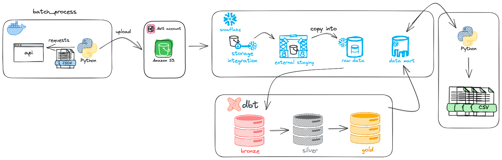

# API FOOTBALL PROJECT
<hr>

## CHALLENGE 
<p>The primary goal of this task is to assess your proficiency in both Python and SQL,
particularly in data modeling and querying. Your task involves consuming Football (Soccer)
data from an API, storing it within a database of your preference, and crafting analytical
queries for insights.

 The league must be Premier League at Season 2022/2023.

 Answering the questions: 

1. Final League Table (query_a) 
2. Display all teams sorted by Away goals scored. (query_b) 
3. Top 5 Referees with Most Cards (query_c) 
4. Top 3 Goal Scorers by Match Round 14 (query_d) 
</p>

### 1. DATA ARCHITECTURE



### 2. SOLUTION

#### 2.1 EXTRACT 
<p> It's a batch architecture, my aproach was developing 4 python scripts to take care of ELT:</p>

<b>1.</b> ```api_football.py``` - This Python script contains a class, `APIFootball`, designed to simplify the process of connecting to the Football API. The class allows you to perform various API actions by providing the action name and query string.
- To use this class, you need to set your Football API key as an environment variable named `API_KEY`. You can obtain an API key by signing up on the Football API website.


<b>2.</b> ```data_requester.py``` - The `DataRequester` class is designed to simplify the process of requesting football events data from the Football API using the `APIFootball`.

<b>3.</b> ```data_uploader.py``` - The `DataUploader` class is responsible for uploading data to an Amazon S3 (Simple Storage Service) bucket. 

<b>4.</b> ```main.py``` - The `main.py` script is the core component of the application. This script is responsible for orchestrating the process of collecting football events data from the Football API via `DataRequester` class and uploading it to the S3 using the `DataUploader` class

#### 2.2 LOAD 

 ##### SNOWFLAKE
 <p> Created a free account in Snowflake to exploration, my option was the Enterprise because it have more resources. </p> 

  - <p>You can see the snowflake process steps in the: 
     
     [Snowflake Directory](./snowflake/steps/)</p>
>
  - <b>STEP 1. STORAGE INTEGRATION</b>
    - <p>Created a storage integration between snowflake and S3. It's necessary to create IAM role and policy in AWS to it</p>
  - <b>STEP 2. FILE FORMAT</b>
    - <p>Created a json file format, because the default file format wasn't enough</p>
  - <b>STEP 3. EXTERNAL STAGE</b>
    - <p>Creating an External Stage allows you to easily access and manage data stored in an external storage service, in my case, Amazon S3.</p>
  - <b>STEP 4. DATABASE, SCHEMA, TABLE RAW AND COPY INTO</b>
    - <p>It is necessary to create the entire context for the raw table that will be used to receive the data from the json and the copy into is used to load the table.</p>


#### 2.3 TRANSFORM

##### DBT 
  - <p> Created a free account in dbt and linked it to Snowflake. I utilized the dbt cloud and tried to follow best practices according to the dbt manifesto</p>
  - <p>Created three stages: </p>
  - <p> <b> Bronze: </b> The goal of bronze is to prepare the data for subsequent transformation and loading steps.</p>
  - <p> <b> Silver: </b>  Involves transforming the data into a more refined form, often including cleaning, aggregation, filtering, and other manipulations. In this step, the data is structured and prepared for further analysis or data model creation </p>
  - <p> <b>  Gold: </b> These are datasets ready for analysis, optimized for efficient querying and visualization. </p>
  - <p> Executed dbt build, and these transformations were returned to Snowflake ready for analysis.</p>
  - <p>You can see the dbt process steps in: 
     
     [Models](./models/)</p>

#### 2.4 TO .CSV 
```convert_to_csv.py``` - Is a Python script designed to extract data from a Snowflake database and export it to CSV files. This script utilizes the Pandas library to fetch data from Snowflake and convert it into CSV format. 

<b> The querys results are here: </b> [Querys](./data_csv/csv/)

### 3. PROBLEMS
<p> 1. I found some inconsistencies while answering the "Top 5 Referees with Most Cards" topic, which in the API some coaches are with red or yellow cards but in
 the official websites like premier legue and transfermarkt don't count it. 
 2. Some matches in the API had some problem and are without data.
</p>

### 4. TECH STACK 


